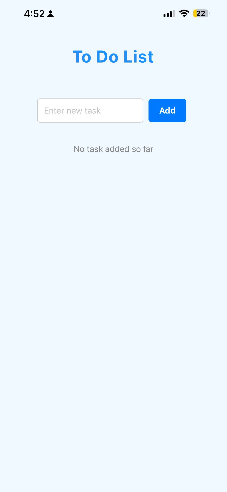
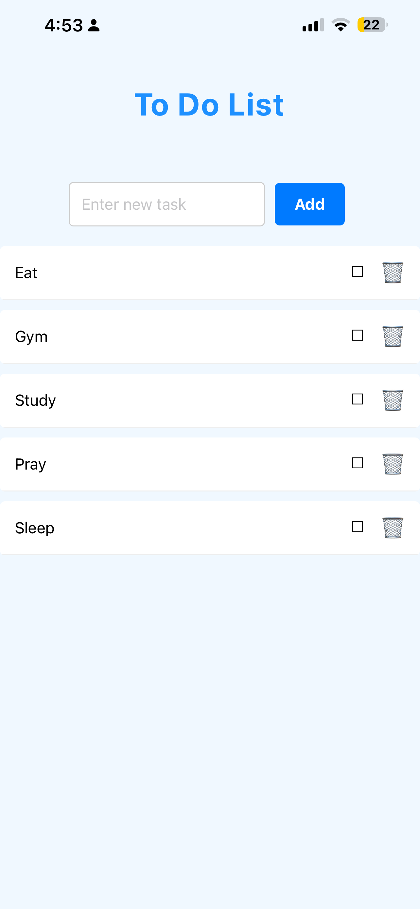
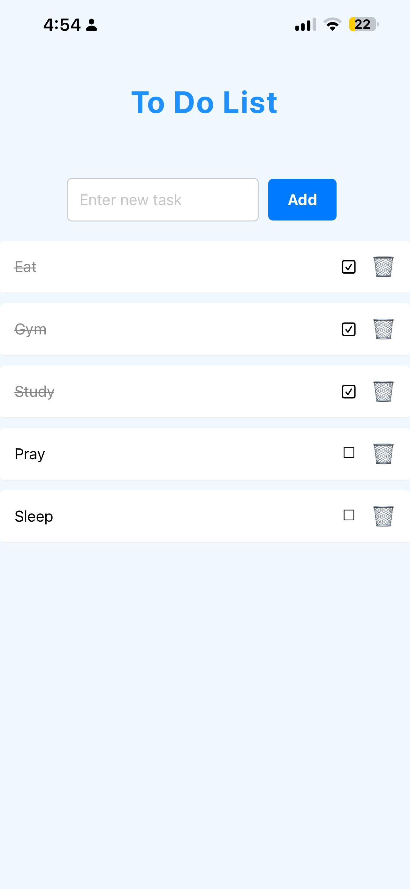
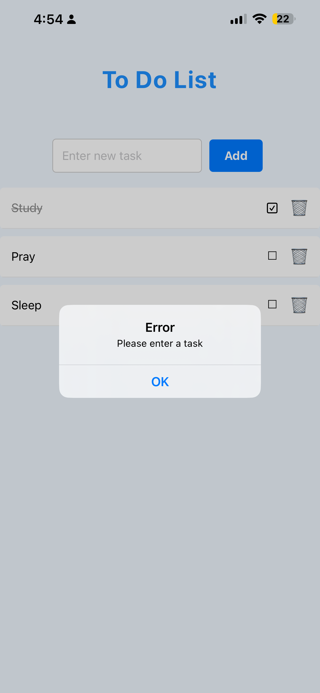

# Task List Mobile App (GradedLab 05)

## Description

This is a fifth gradedLab React Native application that implements a mobile task tracker app with add, complete, and delete functionality as requested in the question. The app uses React Native components, state management with hooks, FlatList for efficient rendering, and proper mobile styling for task management.

## How to Run

1. **Move inside the project root:**
   ```bash
   cd gradedlab05
   ```

2. **Install dependencies:**
   ```bash
   npm install
   ```

3. **Start the development server:**
   ```bash
   npm start
   ```

4. **Run on your device**
   - Scan the QR code with Expo Go app (Android/iOS)
   - Or run on an emulator (Android Studio/Xcode)

## Contents

1. Task Input Screen


2. Adding Multiple Tasks


3. Completed Tasks with Visual Feedback


4. Task Management (Add/Complete/Delete)


5. Error Message for Empty Input  
   

## Features

- Mobile-optimized task list interface with proper spacing
- Text input field for entering new tasks with Add button
- FlatList for efficient rendering of task items
- Mark tasks as completed by tapping task text or checkbox
- Visual feedback for completed tasks (crossed out, grayed text)
- Delete tasks using trash icon button
- Scrollable list that handles many tasks efficiently
- Form validation for empty task entries